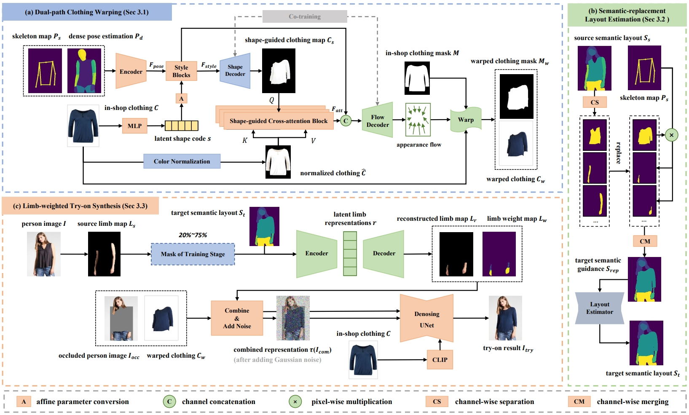
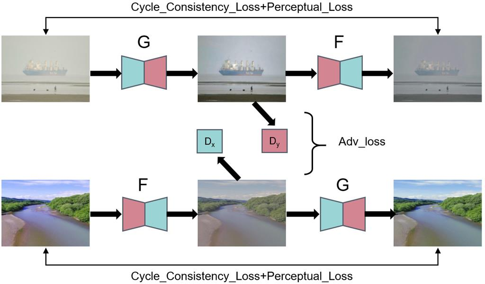

<!-- * B.S. in Communication Engineering, Hefei University of Technology, 2019
* M.S. in Computer Science and Technology, Harbin Institute of Technology, 2021
* Ph.D. in Computer Science and Technology, Harbin Institute of Technology, 2025 (expected) -->
Hi, this is Shunyuan Zheng. I am a third-year (2021~) Ph.D. student in Faculty of Computing, Harbin Institute of Technology, advised by Prof. [Shengping Zhang](https://homepage.hit.edu.cn/zhangshengping).
My research focuses on **human-centric 3D vision**, including 3D human reconstruction, novel view synthesis, etc.
From 2023 to 2024, I worked as a research intern at the 3D Vision and Computational Photography Group, Tsinghua University, guided by Prof. [Yebin Liu](https://liuyebin.com). 
 
<b>E-mail:</b> sawyer0503[AT]hit.edu.cn 
<b>WeChat:</b> Tau97_Zheng

## Background

<table style="width:100%;border:none;border-spacing:0px;border-collapse:separate;margin-right:auto;margin-left:auto;font-size: large">
<tr>
<td style="padding:20px;width:25%;vertical-align:middle;border:none" align="center">
 
</td>
<td style="padding:20px;width:75%;vertical-align:middle;border: none" align="left">
Ph.D. Student. Sep. 2021 - Present 
Master of Engineering. Sep. 2019 - Jun. 2021 
<a href="https://encs.hit.edu.cn">Faculty of Computing</a> 
<a href="http://en.hit.edu.cn">Harbin Institute of Technology</a> 
</td>
</tr>

<tr>
<td style="padding:20px;width:25%;vertical-align:middle;border:none" align="center">
 
</td>
<td style="padding:20px;width:75%;vertical-align:middle;border: none" align="left">
Bachelor of Engineering. Sep. 2015 - Jun. 2019 
<a href="https://ci.hfut.edu.cn/English/Home.htm">School of Computer Science and Information Engineering</a> 
<a href="https://www.hfut.edu.cn">Hefei University of Technology</a> 
</td>
</tr>
</table>    

## Research

<table style="width:100%;border:none;border-spacing:0px;border-collapse:separate;margin-right:auto;margin-left:auto;font-size: large">
<tr>
<td style="padding:0px;width:30%;vertical-align:middle;border:none" align="center">

<!-- <video width="100%" playsinline="" autoplay="autoplay" loop="loop" preload="" muted="">
  <source src="../images/GPS-Gaussian_Plus.mp4" type="video/mp4">
</video> -->
</td>
<td style="padding-left:20px;width:70%;vertical-align:middle;border: none" align="left">
<b>GPS-Gaussian+: Generalizable Pixel-wise 3D Gaussian Splatting for Real-Time Human-Scene Rendering from Sparse Views</b> 
Boyao Zhou*, <b>Shunyuan Zheng</b>*, Hanzhang Tu, Ruizhi Shao, Boning Liu, Shengping Zhang, Liqiang Nie, Yebin Liu (*=equal contribution) 
<i>arXiv, 2024</i> 
<a href="https://yaourtb.github.io/GPS-Gaussian+"><i class="fas fa-fw fa-globe"></i>Project</a> /
<a href="https://arxiv.org/pdf/2411.11363"><i class="fas fa-fw fa-file-pdf"></i>Paper</a> 
</td>
</tr>
</table>

---

<table style="width:100%;border:none;border-spacing:0px;border-collapse:separate;margin-right:auto;margin-left:auto;font-size: large">
<tr>
<td style="padding:0px;width:30%;vertical-align:middle;border:none" align="center">

</td>
<td style="padding-left:20px;width:70%;vertical-align:middle;border: none" align="left">
<b>Shape-Guided Clothing Warping for Virtual Try-On</b> 
Xiaoyu Han, <b>Shunyuan Zheng</b>, Zonglin Li, Chenyang Wang, Xin Sun, Quanling Meng 
<i>ACM International Conference on Multimedia (<b>ACM MM</b>), 2024</i> 
<a href="https://dl.acm.org/doi/10.1145/3664647.3680756"><i class="fas fa-fw fa-file-pdf"></i>Paper</a> /
<a href=""><i class="fab fa-fw fa-github"></i>Code (Coming Soon)</a>
</td>
</tr>
</table>

---

<table style="width:100%;border:none;border-spacing:0px;border-collapse:separate;margin-right:auto;margin-left:auto;font-size: large">
<tr>
<td style="padding:0px;width:30%;vertical-align:middle;border:none" align="center">

</td>
<td style="padding-left:20px;width:70%;vertical-align:middle;border: none" align="left">
<b>GPS-Gaussian: Generalizable Pixel-wise 3D Gaussian Splatting for Real-time Human Novel View Synthesis</b> 
<b>Shunyuan Zheng</b>, Boyao Zhou, Ruizhi Shao, Boning Liu, Shengping Zhang, Liqiang Nie, Yebin Liu 
<i>IEEE Conference on Computer Vision and Pattern Recognition (<b>CVPR</b>), 2024</i>  (Highlight) 
<a href="https://shunyuanzheng.github.io/GPS-Gaussian"><i class="fas fa-fw fa-globe"></i>Project</a> /
<a href="https://arxiv.org/pdf/2312.02155"><i class="fas fa-fw fa-file-pdf"></i>Paper</a> /
<a href="https://youtu.be/HjnBAqjGIAo"><i class="fas fa-fw fa-video"></i>Video</a> /
<a href="https://github.com/aipixel/GPS-Gaussian"><i class="fab fa-fw fa-github"></i>Code</a>
</td>
</tr>
</table>

---

<table style="width:100%;border:none;border-spacing:0px;border-collapse:separate;margin-right:auto;margin-left:auto;font-size: large">
<tr>
<td style="padding:0px;width:30%;vertical-align:middle;border:none" align="center">

</td>
<td style="padding-left:20px;width:70%;vertical-align:middle;border: none" align="left">
<b>Tele-Aloha: A Telepresence System with Low-budget and High-authenticity Using Sparse RGB Cameras</b> 
Hanzhang Tu, Ruizhi Shao, Xue Dong, <b>Shunyuan Zheng</b>, Hao Zhang, Lili Chen, Meili Wang, Wenyu Li, Siyan Ma, Shengping Zhang, Boyao Zhou, Yebin Liu 
<i>ACM <b>SIGGRAPH</b> Conference Proceedings, 2024</i> 
<a href="https://itoshiko.com/c/Tele-Aloha"><i class="fas fa-fw fa-globe"></i>Project</a> /
<a href="https://arxiv.org/pdf/2405.14866"><i class="fas fa-fw fa-file-pdf"></i>Paper</a> /
<a href="https://itoshiko.com/c/Tele-Aloha/#vid"><i class="fas fa-fw fa-video"></i>Video</a>
</td>
</tr>
</table>

---

<table style="width:100%;border:none;border-spacing:0px;border-collapse:separate;margin-right:auto;margin-left:auto;font-size: large">
<tr>
<td style="padding:0px;width:30%;vertical-align:middle;border:none" align="center">

</td>
<td style="padding-left:20px;width:70%;vertical-align:middle;border: none" align="left">
<b>Overwater Image Dehazing via Cycle-Consistent Generative Adversarial Network</b> 
<b>Shunyuan Zheng</b>, Jiamin Sun, Qinglin Liu, Yuankai Qi, Shengping Zhang 
<i>Asian Conference on Computer Vision (<b>ACCV</b>), 2020</i> 
<a href="https://openaccess.thecvf.com/content/ACCV2020/papers/Zheng_Overwater_Image_Dehazing_via_Cycle-Consistent_Generative_Adversarial_Network_ACCV_2020_paper.pdf"><i class="fas fa-fw fa-file-pdf"></i>Paper</a> /
<a href="https://github.com/ShunyuanZheng/OWI-DehazeGAN"><i class="fab fa-fw fa-github"></i>Code</a>
</td>
</tr>
</table>

## Talk
+ GPS-Gaussian：基于像素级可泛化3D高斯的人体新视点合成 ([深蓝学院](https://www.shenlanxueyuan.com/open/course/226))

## Award
+ National Scholarship, Ministry of Education of China, 2020

## Contact
E-mail: sawyer0503[AT]hit.edu.cn 
WeChat: Tau97_Zheng
